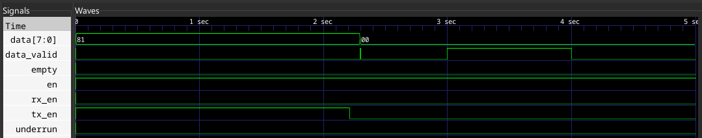
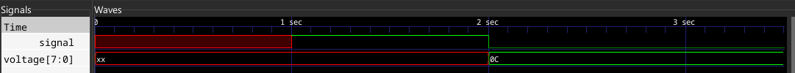
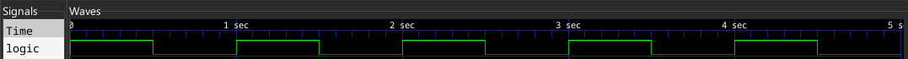

# VCD4j usage examples
Files in this the [examples](src/examples/examples/) directory demonstrate basic usage examples of the library.  

## [VCDParserExample](examples/VCDParserExample.java)
`VCDParser` is used to read and parse VCD data from `.vcd` files.  

  
An example input VCD file  

And here is an example output of the Parser example:  
```
Version: VCD generator tool version info text.
Date: Date text. For example: November 11, 2009.
Comment: Any comment text.
Time scale: 1 millisecond

Variables:
8-bit variable named "data" (key #)
1-bit variable named "data_valid" (key $)
1-bit variable named "en" (key %)
1-bit variable named "rx_en" (key &)
1-bit variable named "tx_en" (key ')
1-bit variable named "empty" (key ()
1-bit variable named "underrun" (key ))

Value changes:
Variable "data" changed to Undefined until 0
Variable "data_valid" changed to UNDEFINED until 0
Variable "en" changed to LOW until 0
Variable "rx_en" changed to UNDEFINED until 0
Variable "tx_en" changed to UNDEFINED until 0
Variable "empty" changed to HIGH until 0
Variable "underrun" changed to LOW until 0

Variable "data" changed to 0x81 until 2211
Variable "data_valid" changed to LOW until 2211
Variable "en" changed to HIGH until 2211
Variable "rx_en" changed to LOW until 2211
Variable "tx_en" changed to HIGH until 2211
Variable "empty" changed to LOW until 2211
Variable "underrun" changed to LOW until 2211

Variable "tx_en" changed to LOW until 2296

Variable "data" changed to 0x0 until 2302
Variable "data_valid" changed to HIGH until 2302

Variable "data_valid" changed to LOW until 3000

Variable "data_valid" changed to HIGH until 4000

Variable "data_valid" changed to LOW until 5000
```  

## [VCDWriterExample](examples/VCDWriterExample.java)
`VCDWriter`'s purpose is to write a `VCD` object to a file or an output stream.  

  
A file generated by the example code.  

## [VCDPlayerExample](examples/VCDParserExample.java)
`VCDPlayer` takes a `VCD` object (constructed manually or parsed with `VCDParser`) and plays it in real time.  

## [VCDRecorderExample](examples/VCDRecorderExample.java)
`VCDRecorder` records signals (both binary and multi-bit) from arbitrary sources and stores them in a `VCD` object that can then be replayed or saved to file.  

  
Example of a file generated with `VCDRecorder`  

# Running the examples
See [REAMDE.md#Examples](../../../../../../vcd4j#examples)